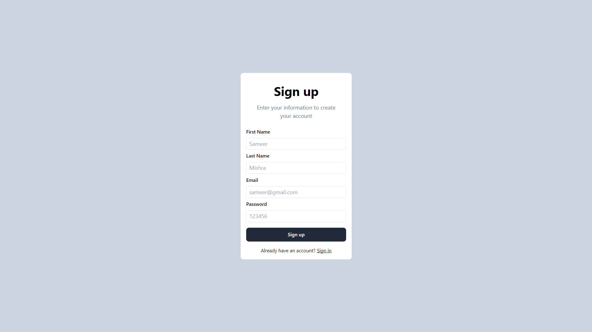

  

## A basic version of PayTM

 - Users can sign up
 - Users can sign in
 - Users can see fellow users in the Dashboard
 - Users can send money as long as they have sufficient balance
---
#### Stack Used:

##### Backend -

 1. Express - HTTP server
 2.  Mongoose - ODM to connect to MongoDB
3.  Zod - Input validation

##### Frontend - 

 1. React - Frontend framework
 2. Tailwind - Styling framework
---
Sign up -

Send Money -
